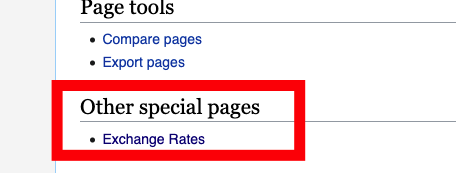
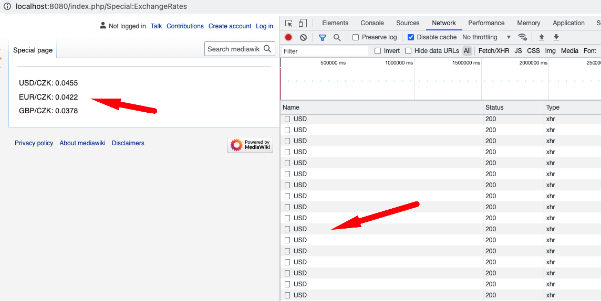

## Implementation of the test task

This task was implemented by creating an extension adding another SpecialPage type called `ExchangeRates`.

## Installation

See [INSTALL.md](INSTALL.md)

## Usage

This extension adds another special page type: `Exchange Rates`. After a successful install you should see it under "Other special pages" category in "Special pages" config section of Mediawiki.

If you click it, the resulting page will periodically (every minute, see packed js) call `api.exchangerate-api.com` API for the following exchange rate pairs:

## Notes for the evaluation

1. Of course the packed dockerfile is only for development purposes. I needed xdebug, so I extended the LTS mediawiki image and added xdebug extension. In prod it should not be used
2. Tests are absent, but I should have written them
3. No proper I18N